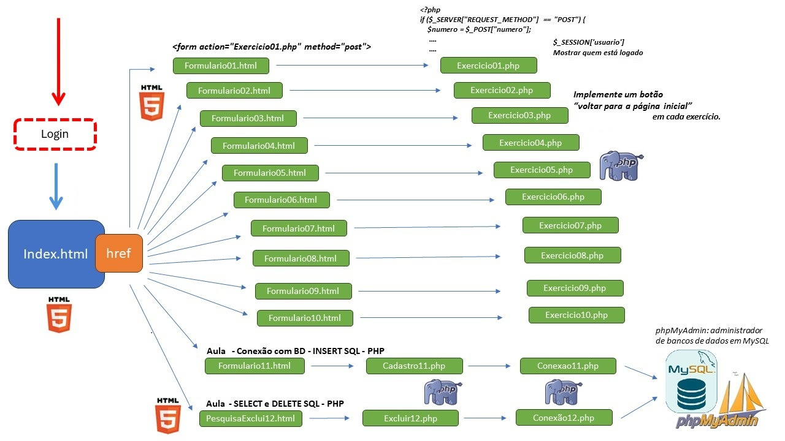

## Atividade Avaliativa de "Programação I" dia 05/10/2025

ADS – Tecnologia em Análise e Desenvolvimento de Sistemas
Prática de Linguagem de Programação I - PHP
Professor: Rafael N.R.

Exercícios Avaliativos - 2,5 pts

Crie um index.html que redirecione para o front-end de cada exercício, ou seja, construa uma página inicial com links para os 
diferentes exercícios. Cada link levará a um formulário específico para o exercício, redirecionando para o código PHP em uma 
página dedicada para cada exercício. 
Login: Implemente um login simples antes de entrar no index. 
Session: Usada apenas para autenticar: verificar se o usuário está logado. 
Cookie: Armazena o histórico de ações do usuário em cada exercício (ex: "último número verificado", "última tabuada gerada", 
etc). 
Resultados devem usar cores diferenciadas via CSS (vermelho, verde, azul, etc) conforme o tipo de saída. 
Exemplo - Estrutura de Arquivos: 
index.html (página inicial com os links que redireciona para cada exercício01.html, contendo um formulário html que envia dados 
via post para um arquivo exercicio01.php e executa o que for pedido em cada exercício) 
Formulario01.html (páginas front-end de cada exercício) → Exercicio01.php (páginas back-end de cada exercício) 
Abaixo, o index.html (Página inicial com os links de cada exercício) – Adicione CSS em todo arquivos/páginas 
<!DOCTYPE html> 
<html lang="pt-BR">
<head>
<meta charset="UTF-8">
<meta name="viewport" content="width=device-width, initial-scale=1.0">
<title>Lista de Exercícios PHP</title>
</head>
<body>
<h1>Lista de Exercícios PHP</h1>
<ul>
<li><a href="exercicio1.html">Exercício 1 - Verificação de Número Positivo, Negativo ou Zero</a></li>
<li><a href="exercicio2.html">Exercício 2 - Tabuada de um Número</a></li>
<li><a href="exercicio3.html">Exercício 3 - Cálculo do Fatorial com Recursão</a></li>
<li><a href="exercicio4.html">Exercício 4 - Calculadora com SwitchCase</a></li>
<li><a href="exercicio5.html">Exercício 5 - Verificação de Número Par ou Ímpar</a></li>
<li><a href="exercicio6.html">Exercício 6 - Impressão de Valores em Ordem Crescente</a></li>
<li><a href="exercicio7.html">Exercício 7 - Comparação de Valores A e B</a></li>
<li><a href="exercicio8.html">Exercício 8 - Cálculo da Média Final de um Aluno</a></li>
<li><a href="exercicio9.html">Exercício 9 - Verificação de Maioridade</a></li>
<li><a href="exercicio10.html">Exercício 10 - Identificação do Mês pelo Número</a></li>
<li><a href="exercicio11.html">Exercício 11 - Cadastro de Alunos e Carga Horária para Atividades
Complementares </a></li>
<li><a href="exercicio12.html">Exercício 12 - Realizando Buscas e Exclusão de Registros no Banco de Dados com
PHP </a></li>

</ul>
</body>
</html> 

Implementar Login e Autenticação 
Use session_start() no início dos arquivos exercícios mostrando a autenticação. 
Após o usuário preencher o formulário de login com sucesso, armazene apenas o nome do usuário na sessão. O uso da session é 
exclusivo para controle de login. Você pode criar um arquivo chamado includes/autenticacao.php. 
Resumo: session_start() no início de login.php, implementar logout.php e autenticacao.php 
Implementar Autenticação com session: 
session_start() deve ser usado somente para armazenar o login do usuário. 
Deve mostrar quem está logado em todos os exercícios: require_once 'includes/auth.php'; 
Exemplo: $_SESSION['usuario'] = 'joao'; 
Em autenticacao.php, verifique apenas isso: se $_SESSION['usuario'] existe. 
Implementar Uso de cookies para Histórico por Exercício 
Cada exercício deve gravar no cookie a última ação realizada pelo usuário. 
Use setcookie('ex01_ultimo', $valor, tempo) para salvar a entrada. No carregamento do .html ou .php, leia o cookie e mostre: "Último 
valor usado: 5" 
// Cookie válido por 1 minuto para testar cookies durante os testes 
setcookie('nome', 'valor', time() + 60); 
 
1) Verificação de número positivo, negativo ou zero (0,1 pt) 
Enunciado: Desenvolva um algoritmo em PHP que receba, através de um formulário HTML, um número digitado pelo usuário e 
determine se o valor é positivo, negativo ou igual a zero. A resposta deve ser exibida no navegador em formato de mensagem. 
Saída com CSS: 
 
"Valor positivo" → classe .resultado-pos (verde) 
"Valor negativo" → .resultado-neg (vermelho) 
"Igual a zero" → .resultado-zero (azul) 
 
Passos a seguir: 
Crie um formulário HTML que envie o número para o backend PHP via método POST. 
O PHP deve processar a entrada e exibir o resultado na mesma página ou em uma página separada. 
Regra geral: 
Session: só para mostrar quem está logado (via auth.php) 
Cookie: para gravar a última entrada do usuário neste exercício - Salve em cookie: setcookie('ex01_ultimo', $numero, ...). Na 
próxima visita, mostre: "Último número: -3"  
2) Exibição da tabuada de um número (0,1 pt) 
Enunciado: Implemente um algoritmo em PHP que receba, por meio de um formulário HTML, um número inteiro e exiba no 
navegador a tabuada desse número de 0 a 10. O resultado deve ser exibido em formato de lista. 
Passos a seguir: 
Crie um formulário HTML que receba o número do usuário e envie via POST. 
O PHP deve calcular e exibir a tabuada no navegador, conforme o número informado. 
Regra geral: 
Session: só para mostrar quem está logado (via auth.php) 
Cookie: para gravar a última entrada do usuário neste exercício - Salve em cookie: setcookie('ex02_numero', $num, ...) e 
setcookie('ex02_formato', $formato, ...)  
3) Cálculo do fatorial de um número – RECURSIVO (0,1 pt) 
Enunciado: Desenvolva um algoritmo em PHP que receba um número inteiro via formulário HTML, valide: número entre 0 e 20, e 
calcule o fatorial desse número. O resultado deve ser exibido na tela, inclusive os números que contemplam o fatorial. Exemplo: 
"5! = 5 × 4 × 3 × 2 × 1 = 120". CSS: Use fundo verde claro para sucesso, vermelho para erro. 
Passos a seguir: 
Crie um formulário HTML para a entrada do número. 
O PHP deve calcular o fatorial e apresentar o resultado na mesma página ou redirecionar para uma nova. 
Session: só para mostrar quem está logado (via auth.php) 
Salve em cookie: ex03_ultimo = 5  
4) Calculadora com switch (0,1 pt) 
Enunciado: Crie uma calculadora em PHP que receba duas entradas numéricas e uma operação (soma, subtração, 
multiplicação ou divisão) através de um formulário HTML. Dependendo da operação escolhida, o sistema deve realizar a 
operação e exibir o resultado. Operações: +, −, ×, ÷, ^ (potência), √ (raiz) 
Passos a seguir: 
Crie um formulário HTML com dois campos de entrada para os números e uma opção para selecionar a operação. O PHP 
deve usar switch case para realizar a operação e exibir o resultado no navegador. 
Trate divisão por zero. 
CSS: "Resultado: 8 × 3 = 24" com fundo verde. 
Salve em cookie: ex04_ultimo = "8 * 3 = 24"  
5) Verificação de número par ou ímpar (0,1 pt) 
Enunciado: Desenvolva um algoritmo em PHP que receba, através de um formulário HTML, um número inteiro e verifique se 
ele é par ou ímpar. O sistema deve exibir a mensagem correspondente no navegador. 
Passos a seguir: 
Crie um formulário HTML para a entrada do número. 
O PHP deve processar a verificação de paridade e exibir o resultado. 
 
CSS: "7 é ímpar" → cor roxa (resultado-impar) 
"4 é par" → amarelo (resultado-par) 
Salve em cookie: ex05_ultimo = 7  
6) Impressão de valores em ordem crescente (0,1 pt) 
Enunciado: Implemente um algoritmo em PHP que receba 5 números, A, B, C, D e E, através de um formulário HTML, e exiba 
os valores em ordem crescente no navegador. 
Passos a seguir: 
Crie um formulário HTML para a entrada de 5 números. 
O PHP deve comparar os valores e exibir o resultado em ordem crescente. 
CSS: Destaque menor (verde), médio (amarelo), maior (vermelho). Exiba com cores diferenciadas. 
Salve em cookie: ex07_resultado = "maior:10,medio:5,menor:2" 
 
7) Comparação de valores A e B (0,1 pt) 
Enunciado: Desenvolva um algoritmo em PHP que receba dois valores (A e B) através de um formulário HTML e verifique 
se A é maior ou menor que B. Exiba a mensagem: "A maior que B" ou "A menor que B". 
Passos a seguir: 
Crie um formulário HTML para os valores A e B. 
O PHP deve realizar a comparação e exibir o resultado.  
8) Média SGA com Recuperação (0,1 pt) 
Enunciado: Crie um algoritmo em PHP que receba três notas de um aluno via formulário HTML. As notas devem ser 
armazenadas em um array e a média final calculada. O sistema deve exibir a média e a situação do aluno: "Aprovado" (média ≥ 7) 
ou "Reprovado" (média < 7). Considere o sistema de notas do SGA: ((A1*2)+(A2*2)+(A3*1))/5 . Se < 7, peça recuperação. 
Nova média: (média + REC)/2 
Passos a seguir: 
Crie um formulário HTML com três campos para as notas. 
O PHP deve calcular a média e exibir a situação do aluno no navegador. 
CSS: Situação: 
≥ 7 → verde 
≥ 5 e < 7 → amarelo ("Recuperação") 
< 5 → vermelho 
Salve em cookie: ex08_media = 6.8  
9) Verificação de maioridade (0,1 pt) 
Enunciado: Desenvolva um algoritmo em PHP que receba, via formulário HTML, o nome e a idade de um usuário. O sistema 
deve verificar se o usuário é maior ou menor de 18 anos e exibir uma mensagem personalizada no formato: "Fulano é maior de 
18 e tem XX anos" ou "Fulano não é maior de 18 e tem XX anos". 
Passos a seguir: 
Crie um formulário HTML para a entrada do nome e da idade. 
O PHP deve processar a verificação e exibir a mensagem correspondente. 
CSS: Classifique: 
0–12: criança (azul) 
13–17: adolescente (roxo) 
18–59: adulto (verde) 
60+: idoso (laranja) 
Salve em cookie: ex09_ultimo = "Ana,15"  
10) Mês e Validador de Data (0,1 pt) 
Enunciado: Crie um algoritmo em PHP que receba, por meio de um formulário HTML, um número inteiro entre 1 e 12 e exiba o 
nome do mês correspondente a esse número. Caso o número seja fora do intervalo, o sistema deve informar que não existe 
mês com esse número. 
Passos a seguir: 
Crie um formulário HTML que receba um número de 1 a 12. 
O PHP deve usar switch para exibir o nome do mês correspondente ou informar que o número não é válido. 
Salve em cookie: ex10_data = "15,3" 
 
11) Cadastro de Alunos e Carga Horária para Atividades Complementares 
Contexto: 
O objetivo desta tarefa é desenvolver um sistema simples de cadastro de alunos utilizando HTML e PHP, com a capacidade de 
registrar e gerenciar informações relacionadas a atividades complementares. O sistema deve permitir o cadastro de dados dos 
alunos em um banco de dados MySQL, bem como a inserção e atualização da carga horária referente às atividades 
complementares. Os alunos deverão ser identificados por meio de sua matrícula, e a carga horária poderá ser atualizada 
conforme forem realizadas mais atividades. Após cadastro, mostre: "Aluno cadastrado com sucesso!" (verde) 
Requisitos da Tarefa: 
Criação do Banco de Dados: 
O banco de dados MySQL no PHPMyAdmin deve conter uma tabela chamada alunos com os seguintes campos: id (chave 
primária, auto incremento) / nome (VARCHAR) / matricula (VARCHAR) / curso (VARCHAR) / email (VARCHAR) / telefone 
(VARCHAR) / endereco (VARCHAR) / cep (VARCHAR) / cidade (VARCHAR) / uf (VARCHAR) / curso_horas (VARCHAR) / 
carga_horaria (INT) 
Formulário HTML para Cadastro de Aluno: 
O formulário HTML deve conter campos para coletar as seguintes informações: 
Nome do Aluno / Matrícula / Curso / E-mail Institucional / Telefone / Endereço / CEP / Cidade / UF (Estado) / Curso para 
Horas Complementares / Carga Horária 
O formulário deve enviar os dados via método POST para um script PHP que fará a inserção dos dados no banco de dados. 
Script PHP para Inserção de Dados (cadastro.php): 
O script PHP deve receber os dados enviados pelo formulário e inseri-los no banco de dados utilizando a conexão com MySQL. 
Caso a inserção seja bem-sucedida, o sistema deve informar o sucesso da operação. Caso contrário, o sistema deve exibir uma 
mensagem de erro. 
Desafio: Formulário para Atualização da Carga Horária: 
O sistema deve conter um segundo formulário HTML onde o usuário poderá informar a matrícula do aluno e uma nova carga 
horária a ser somada ao valor existente. 
Ao enviar o formulário, o script PHP deve consultar a carga horária atual do aluno no banco de dados, somar a nova carga 
horária e atualizar o valor no banco. 
Script PHP para Atualização da Carga Horária (somar_carga.php): 
O script PHP deve realizar a consulta no banco de dados para obter a carga horária atual do aluno, somar a nova carga 
horária, e atualizar o banco de dados. 
Caso o aluno não seja encontrado, o sistema deve informar que a matrícula fornecida não está registrada. 
Base para realizar o exercício: Aula - Conexão com BD - INSERT SQL – PHP 
Exemplo do pdf02 - Projeto Conexão com Banco de Dados PHP 
-Neste exemplo, temos 3 arquivos separadamente, e existe uma função include("conexao1.php") no início do cadastro.php que 
"chama" outro arquivo conexao1.php do banco de dados. 
// include("conexao1.php"); faz a conexão com o banco de dados, e executa o script SQL INSERT de acesso ao BD. 
 
12) Realizando Buscas e Exclusão de Registros no Banco de Dados com PHP 
Contexto: 
Nesta tarefa, o objetivo é utilizar o PHP para realizar operações de busca (SELECT) e exclusão (DELETE) de registros no banco 
de dados. A atividade será dividida em duas partes. Na primeira, será feito um sistema de busca no banco de dados para localizar 
registros de alunos a partir de informações como nome, matrícula, ou e-mail institucional. Na segunda parte, você deve 
implementar a funcionalidade de exclusão de registros com base em critérios específicos. 
Campo de busca por Nome do Aluno / Matrícula / E-mail Institucional . Liste todos os alunos em tabela. Ao excluir, remova do 
banco (não do cookie!). 
Requisitos da Tarefa: 
Parte 1 - Realização de Busca de Dados (SELECT SQL - PHP): 
Desenvolva um formulário HTML para realizar a busca de alunos no banco de dados com base nos seguintes critérios: 
Nome do Aluno / Matrícula / E-mail Institucional 
O script PHP deve receber os dados do formulário, realizar a busca no banco de dados utilizando o comando SELECT, e exibir os 
resultados em uma tabela. 
Os dados que devem ser exibidos incluem: 
Nome do Aluno / Matrícula / Curso / E-mail Institucional / Telefone / Endereço / CEP / Cidade / UF / Curso para 
Horas Complementares / Carga Horária 
Parte 2 - Exclusão de Registros (DELETE SQL - PHP): 
Desenvolva um segundo formulário HTML para a exclusão de registros do banco de dados, permitindo que a exclusão 
seja feita com base nos seguintes critérios: 
Nome do Aluno / Matrícula / E-mail Institucional 
O script PHP deve utilizar o comando DELETE para excluir o registro correspondente ao critério escolhido (nome, matrícula 
ou e-mail institucional). 
Após a exclusão, o sistema deve exibir uma mensagem informando se a operação foi realizada com sucesso ou se houve 
algum erro. 
Importante: O sistema deve permitir que o usuário veja os dados existentes antes de realizar a exclusão, garantindo que o 
registro correto seja excluído. 
Base para realizar o exercício: Aula 06 - SELECT e DELETE SQL – PHP 
Tarefa da parte 01: Realizar a busca dos dados no banco. 
Tarefa da parte 02: Realizar a exclusão. 
Exemplo de como Usar Cookies nos Exercícios (Modelo Genérico) 
No início de cada exercicioXX.php: 
<?php 
require_once 'includes/auth.php'; // só verifica login 
$ultimo_valor = $_COOKIE['ex01_ultimo'] ?? ''; 
?>
